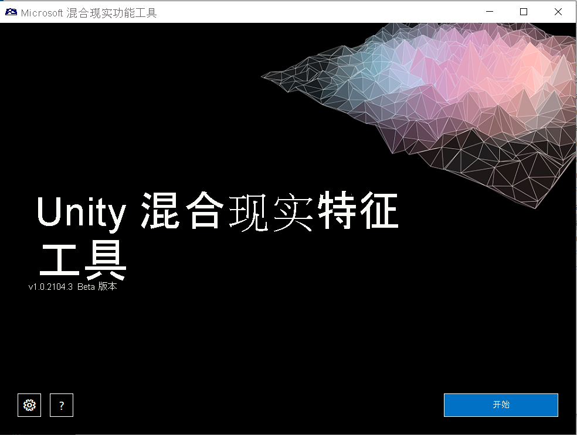
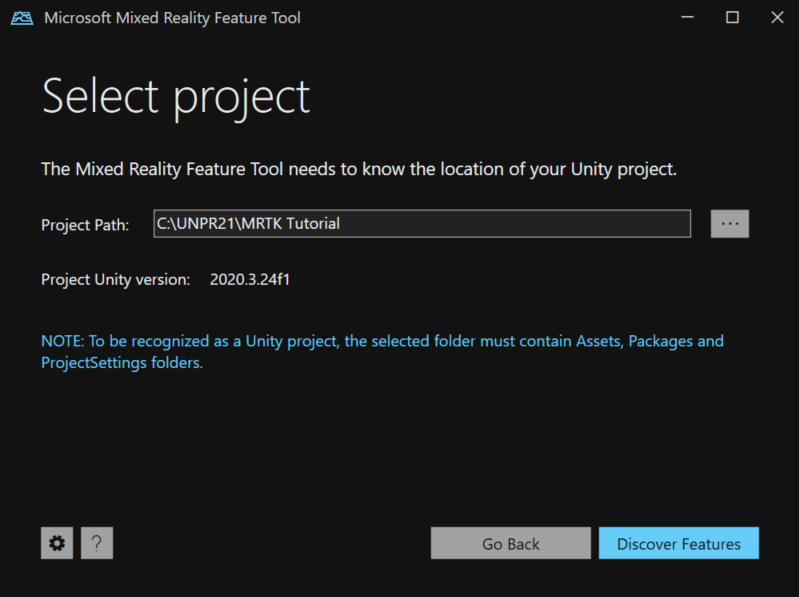
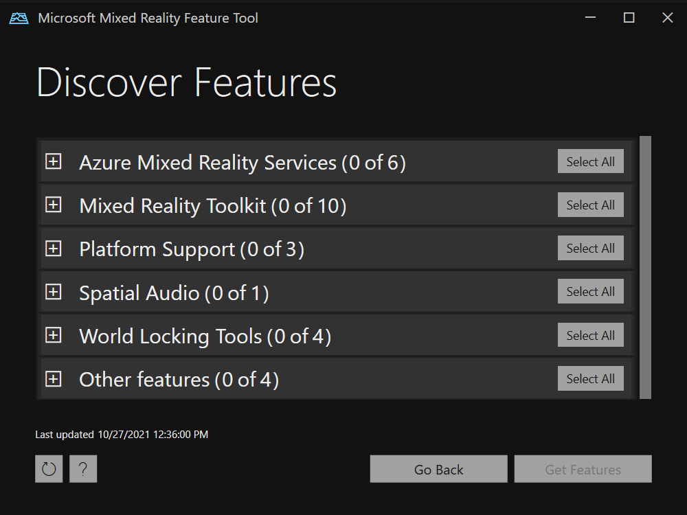
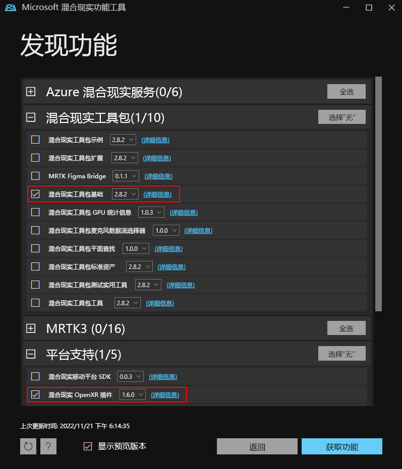
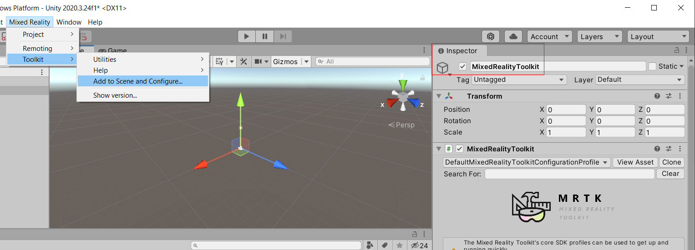
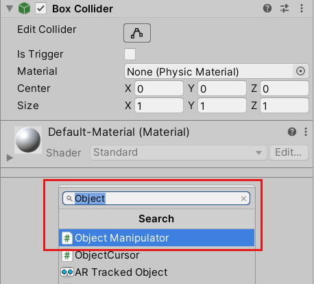
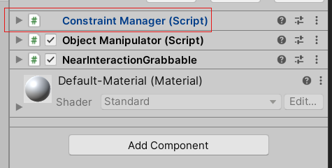
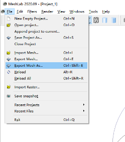
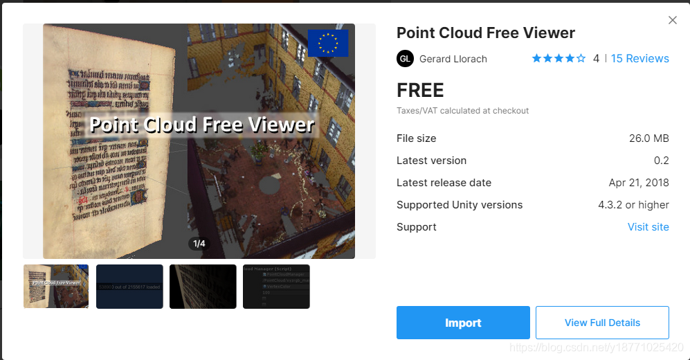
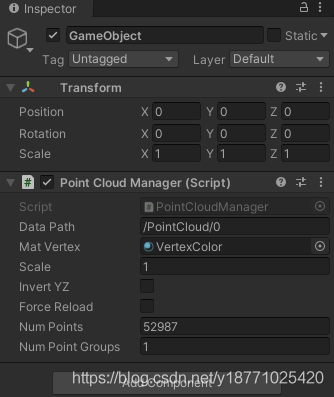

**安装清单**

  ---------------------------------------------------------------------------------------------------------------------------------------------------------------------------------------------------------------------
  **工具**                                                                                
  --------------------------------------------------------------------------------------- -----------------------------------------------------------------------------------------------------------------------------
                **安装 Visual Studio 2022**\
  **\
  [Visual Studio 2022（安装链接）](https://visualstudio.microsoft.com/downloads/)                               
    请确保安装以下工作负载:\
        *● .NET 桌面开发*\
        *● 使用 C++ 的桌面开发*\
        *●适用于 Windows 等的功能齐全的集成开发环境 (IDE)。            
        *● 通用 Windows 平台 (UWP) 开发*\
  来编写代码、调试、测试和部署。**                                                       
   ●使用 Unity 进行游戏开发（如果计划使用 Unity）\
                                                                                          \
                                                                                          注意：如果你先安装了 Unity，可能会预先安装其中一些工作负载。 请确保你拥有成功部署所需的所有这些工作负载。\
                                                                                          \
                                                                                          在 UWP 工作负荷中，请确保包含以下组件以便安装：\
                                                                                          \
                                                                                          ● Windows 10 SDK 版本 10.0.19041.0 或 10.0.18362.0，或 Windows 11 SDK\
                                                                                          ● USB 设备连接（通过 USB 进行 HoloLens 部署/调试所需）\
                                                                                          ● C++ (v142) 通用 Windows 平台工具（使用 Unity 时必需）\
                                                                                          \
                                                                                          有关 HoloLens（第一代）和桌面 Windows Mixed Reality 头戴显示设备的说明\
                                                                                          如果仅针对桌面 Windows Mixed Reality 头戴显示设备或 HoloLens（第 1 代）开发应用程序，则可以使用 Visual Studio 2017 和它安装的
                                                                                          Windows SDK。**
  ---------------------------------------------------------------------------------------------------------------------------------------------------------------------------------------------------------------------

**Windows 10 SDK 10.0.18362.0 或更高版本**

**安装了 Unity 2020.3.x（首选）/2019.4.x 的 Unity Hub**

**混合现实工具包**

**创建新的 Unity 项目**

1.  启动 Unity Hub。

2.  在“项目”选项卡中，单击“新建项目”。

1.  单击“新建项目”下面的下拉列表，然后选择你需要的编辑器版本。

1.  确保所选模板为 3D Core。

2.  在“项目名称”框中，输入项目的名称，例如“MRTK 教程”。

3.  在“位置”框中，单击文件夹图标，然后导航到要在其中保存项目的文件夹，然后选择它。
    也可以新建一个文件夹。

1.  单击“创建项目”。 这会在 Unity 中打开项目。

**注意**

在 Windows 上创建项目时，MAX_PATH 限制为 255 个字符。 Unity
受到这些限制的影响；如果任何文件路径的长度超过 255
个字符，就可能无法编译。 因此，建议将 Unity
项目存储在尽可能靠近驱动器根目录的位置。

**切换生成平台**

若要定目标到 Windows Mixed Reality，必须将 Unity 项目设置为导出为通用
Windows 平台应用。 默认情况下，通用 Windows
平台的生成设置定目标到任何设备，包括对沉浸式头戴显示设备。
不过，可使用“目标设备”下拉列表选择特定设备。

1.  在菜单栏中，选择“文件”\>“生成设置...”。

2.  在“生成设置”窗口中选择“通用 Windows 平台”。

3.  确保以下设置处于活动状态：

体系结构：ARM 64 位

生成类型：D3D 项目

目标 SDK 版本：已安装最新版本

最低平台版本：10.0.10240.0

Visual Studio 版本：已安装最新版本

生成和运行位置：本地计算机

生成配置：发布（释放）（调试存在已知性能问题）

4.  单击“切换平台”按钮。 Unity 在切换平台时会显示进度栏。

5.  切换平台过程完成后，关闭“生成设置”窗口。

**导入 MRTK Unity 基础包**

若要将混合现实工具包导入项目，我们将使用混合现实功能工具，它允许开发人员发现、更新和导入功能包。
你可以按名称或类别搜索包，查看其依赖项，以及在导入之前查看项目清单文件的建议更改。

1.  请从 [Microsoft
    下载中心](https://aka.ms/MRFeatureTool)下载混合现实功能工具的最新版本。

2.  下载完成后，解压缩文件并将其保存到桌面。

**备注**

在运行混合现实功能工具之前，必须安装 [**.NET 5.0
运行时**](https://dotnet.microsoft.com/download/dotnet/5.0)。
虽然此版本不再受支持，但它是适合本练习的版本。

3.  在解压缩的文件夹中，导航到可执行文件
    MixedRealityFeatureTool.exe，然后使用它启动混合现实功能工具。

-   [Unity 2020 +
    Openxr](https://learn.microsoft.com/zh-cn/training/modules/learn-mrtk-tutorials/1-5-exercise-configure-resources?tabs=openxr#tabpanel_1_openxr)

-   [Unity 2019/2020 + windows xr
    插件](https://learn.microsoft.com/zh-cn/training/modules/learn-mrtk-tutorials/1-5-exercise-configure-resources?tabs=openxr#tabpanel_1_winxr)

-   [旧
    wsa](https://learn.microsoft.com/zh-cn/training/modules/learn-mrtk-tutorials/1-5-exercise-configure-resources?tabs=openxr#tabpanel_1_wsa)

1.  在混合现实功能工具中，选择“启动”。

1.  选择“浏览”按钮（它是下图中的“三个点”按钮），导航到你的项目，然后将其打开。

**备注**

该工具中的“项目路径”框必须包含某个值，因此默认情况下会插入一个反斜杠（“\_”）。

选择文件夹后，该工具会进行检查以确保它是有效的 Unity 项目文件夹。

1.  选择“发现功能”。

注意：工具刷新源中的包时可能需要等待几秒钟。

4.  在“发现功能”页上，请注意有可用包组的列表。

5.  单击“混合现实工具包(Mixed Reality
    Toolkit)(0/10)”左侧的“+”按钮，然后选择“混合现实工具包基础版(Mixed
    Reality Toolkit Foundation)”的最新版本。

** 备注**

“混合现实工具包基础”包是唯一的包，必须将它导入并进行配置后，才能在项目中使用
MRTK。 此包中有创建混合现实应用所需的核心组件。

6.  单击“平台支持Platform Support(0/5)”左侧的“+”按钮，然后选择“Mixed
    Reality OpenXR Plugin”的最新版本。

7.  做出选择后，请单击“获取功能”。

8.  选择“验证”以验证所选的包。
    应会看到一个对话框，显示“未检测到任何验证问题”。
    完成后，单击“确定”。

9.  在“导入功能”页上，左侧列的“功能”将显示你刚刚选择的包。
    右侧列的“必需依赖项”显示所有依赖项。
    可以单击其中任一项的“详细信息”链接，了解相关详细信息。

10. 准备好继续时，选择“导入”。在“查看和批准”页上，可以查看有关包的信息。

11. 选择“批准”。

12. 返回到 Unity 编辑器，并单击 UI 中的空白区域。
    你将看到一个进度栏，告知你正在导入你的包。

**配置 Unity 项目**

1.  Unity
    导入包后，会出现一条警告，询问你是否要通过重启编辑器来启用后端。
    选择 **“是”** 。

1.  系统应显示 MRTK 项目配置器。
    如果未显示，请手动打开它：在菜单栏上，选择“混合现实”\>“工具包”\>“实用程序”\>“为
    MRTK 配置项目”：

1.  选择“Unity OpenXR 插件”以启用 XR 插件管理，并将 Unity OpenXR
    插件添加到项目。

1.  在“欢迎使用 MRTK!”屏幕上，选择“显示 XR 插件管理设置”。

1.  随即打开“项目设置”窗口。 确保你位于显示“通用 Windows
    平台”设置（Windows 徽标选项卡）的“XR 插件管理”页面上。

6.  确保选中“在启动时初始化 XR”，然后在“插件提供程序”下单击“打开 XR”。

7.  加载 OpenXR 插件，然后在“OpenXR”下方出现两个项目。
    选择第一个，即“Microsoft HoloLens 功能组”。

8.  关闭“项目设置”窗口。

9.  在“MRTK 项目配置器”窗口中，选择“应用设置”。

10. 在出现的“项目验证”窗口中，确保位于“UWP 平台”选项卡（该选项卡显示
    Windows 徽标）上，然后单击“全部修复”以解决验证问题。
    请注意，单击“全部修复”后可能仍存在问题。
    在这种情况下，请再次单击“全部修复”，忽略标记为“特定于场景”的任何问题，然后阅读针对其余问题的建议（如果有），并进行任何所需的更改。

11. 在“MRTK 配置器”中，单击“下一步”，然后单击“应用”以应用建议的设置。

12. 单击“下一步”，然后单击“导入 TMP Essentials”。

13. 出现“MRTK 安装程序已完成!”面板时，单击“完成”。

**为 OpenXR 配置项目设置**

1.  Unity 重启后，在菜单栏中，选择“编辑”\>“项目设置...”。

2.  在“项目设置”窗口的左侧列中，选择“玩家（player）”。

3.  请注意，在“播放器”窗口中，“产品名称”是“MRTK
    教程”。这取自你的项目名称，将是 HoloLens“开始”菜单中显示的名称。

**提示**

为了使应用在开发期间更易于查找，请在名称前添加一个下划线，以将其排列到任何列表的顶部。

4.  单击“发布设置”下拉列表，然后在“包名称”字段中输入合适的名称，例如
    MRTK-Tutorials-Getting-Started：

**备注**

包名称是应用的唯一标识符。
如果要避免覆盖以前安装的同名应用版本，则应在部署应用之前更改此标识符。

5.  关闭“项目设置”窗口。

**创建场景并配置 MRTK**

1.  在菜单栏中，选择“文件”\>“新建场景”。

2.  在“新建场景”窗口中，选择“基本(内置)”，然后单击“创建”。

3.  在菜单栏中，依次选择“混合现实”\>“工具包”\>“添加到场景并配置...”。

“混合现实工具包”设置会显示在检查器中。

在将 MRTK
添加到场景并对其进行配置后，以下两个新对象会被添加到“层次结构”窗口中：

**MixedRealityToolkit**

**MixedRealityPlayspace**

MixedRealityToolkit 对象包含工具包本身。 MixedRealityPlayspace
对象可确保在场景中正确管理头戴显示设备/控制器和其他必需系统。

“主摄像机”对象成为 MixedRealityPlayspace 对象的子对象。
这使得游戏区域能够与 SDK 同时管理摄像头。

1.  在检查器中，验证配置文件下拉列表是否显示
    DefaultMixedRealityToolkitConfigurationProfile：

**备注**

配置 MRTK 的主要方法之一是选择通过基础包提供的配置文件。 配置文件配置了
MRTK 核心组件的行为。 在将 MRTK
添加到场景后，预先选择的是“DefaultMixedRealityToolkitConfigurationProfile”。
此配置文件适用于常规用途，它未针对任何特定用例进行优化。 MRTK
提供了其他默认配置文件，它们涵盖了 MRTK 支持的大多数平台和场景。
可能需要选择针对所使用的特定平台进行了优化的配置文件。
若要详细了解配置文件，请参阅 [**MRTK
配置文件配置指南**](https://learn.microsoft.com/zh-cn/windows/mixed-reality/mrtk-unity/configuration/mixed-reality-configuration-guide)。

5.  在菜单栏中，选择“文件”\>“另存为...”。

6.  导航到“资产”\>“场景”文件夹，命名项目，然后保存项目。

打开Spatial Awareness 选项卡，然后在里面找到 Disaplay Settings
选项，在Display Option 里面选择None。

这样就关闭了扫描网格的显示功能。

如果相应选项是灰色的，请先clone相应文件。

若要使对象在使用跟踪手时可抓取，必须附加三个组件：

-   碰撞体组件(clooider)

-   “对象操控器(脚本)”组件(object manipulator)

-   NearInteractionGrabbable（脚本）组件

1.  立方体仍然处于选定状态时，在 Inspector 窗口中，单击“Add
    Component”按钮，然后搜索并选择“Object Manipulator”脚本。

ObjectManipulator
脚本能够让对象变得可移动、可缩放和可旋转，这些操作可通过一只或两只手来实现。
添加 Object Manipulator 脚本时，系统会自动添加 Constraint Manager
脚本，因为前者依赖于后者。

1.  重复相同的步骤，向立方体添加“Near Interaction Grabbable”脚本。

通过 NearInteractionGrabbable
脚本，用户能使用模拟手来触碰和抓取附近的对象。

ply文件转off文件

采用meshlab软件将ply转为off文件\
使用meshlab打开ply文件之后，点击File，选择Export Mesh
As，选择保存格式为off文件即可\

下载插件

在Unity的Assets Store里搜索Point Cloud Free
Viewer，点击下载，然后导入即可，导入成功后，会在Assets下创建一个PoinCloud文件夹

添加脚本

将PoinCloud文件夹下的Scripts中的EnablePointSize脚本挂载到相机上，然后在场景中创建一个新的GameObject，将PointCloudManager脚本挂载在GameObject上，将DataPath改为off文件的路径，将Mat
Vertex设置为VertexColor\
\
结束，点击运行即可在Unity场景中看到带颜色的点云文件

输入文件

test.ply

使用工具

MeshLab2020.06

简要步骤

1\. import Mesh

2\. Compute normals

3.Surface Reconstruction

4\. Get texture

修改成4096 0 Basic

5.Save project

6.Transfer color to texture

第一个选Possion的另一个

最后保存obj模型

参考视频：https://www.youtube.com/watch?v=6wP_e37t7PI
